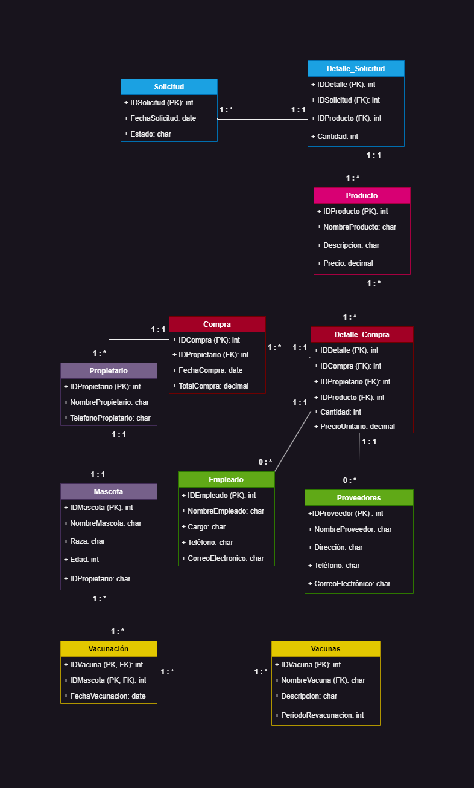

# SegundoParcialBDA
Este repositorio tiene la finalidad de almacenar descripcion e información de una base de datos, diagrama UML y requisitos tecnicos para la instalcion y ejecucion de este. 

## **CINTILLOS PARA MASCOTAS**

### **Descripcion**
Esta base de datos esta diseñada a requerimiento de una convocatorio lanzada por el Gobierno Autonomo Municipal de La Paz donde buscan la adquisición de cintillos de identificación para la campaña de vacunacion antirabica canina, a esta adquisicion se crea esta base de datos como requerimiento de la clase de Base de Datos Avanzada. 
En esta base de datos se detallara toda la informacion importante para la adquisicion de estos cintillos como: informacion de los productos, compra, detalle de la compra, solicitudes, detalle de esta solicitud, empleados, proveedores, propietarios, mascotas, vacunacion y vacunas. A continuacion se mostrara los atributos de cada uno de forma organizada.

### **Diagrama UML**
El diagrama actualizado con normalizacion hasta la 5ta forma para esta base de datos:

Acontinuacion se explica un poco la relacion entre las clases: 
1. Tabla: Solicitud
- Solicitud (1) -> DetallesSolicitud (1 o muchos)

2. Tabla: DetallesSolicitud
- DetallesSolicitud (1) -> Solicitud (1)
- DetallesSolicitud (1) -> Productos (1)

3. Tabla: Productos
- Productos (1) -> DetallesSolicitud (1 o muchos)
- Productos (0 o muchos) -> DetallesCompra (1 o muchos)

4. Tabla: Compra
- Compra (1) -> DetallesCompra (1 o muchos)
- Compra (1) -> Propietarios (1)

5. Tabla: DetallesCompra
- DetallesCompra (1) -> Compra (1)
- DetallesCompra (1) -> Productos (0 o muchos)

6.Tabla: Proveedores
- Proveedores (0 o muchos) -> DetallesCompra (1)

7. Tabla: Empleados
- Empleados (0 o muchos) -> DetallesCompra (1)

8. Tabla: Mascotas
- Mascotas (1 o muchos) -> Vacunacion (1 o muchos)
- Mascotas (1) -> Propietarios (1)

9. Tabla: Propietarios
- Propietarios (1 o muchos) -> Mascotas (1 o muchos)
- Propietarios (1 o muchos) -> Compra (1)

10. Tabla: Vacunacion
- Vacunacion (1 o muchos) -> Mascotas (1 o muchos)
- Vacunacion (1) -> Vacunas (1)

11. Tabla: Vacunas
- Vacunas (1 o muchos) -> Vacunacion (1 o muchos)

### **Requisistos tecnicos**
PASO #1
Inicialmente necesitamos instalar linux en la pc o laptop con el siguiente comando: 

*wsl --install*

PASO #2
Seguido instalas Debian o Ubuntu con el siguiente comando:

*wsl --install -d Debian*

PASO #3
Instalamos Docker Desktop por el navegador

PASO #4
Por defecto ya viene instalado docker-compose y para verificar escribe el siguiente comando:

*docker-compose -v*

PASO #5
Creamos la carpeta .yml con el nombre de su preferencia (ej. mysql.yml). Adjunto link con tutorial mas preciso.

- https://www.arteco-consulting.com/post/instalar-mysql-con-docker

PASO #6
Levantamos docker compose que en mi caso seria con este comando:

*docker-compose -f /home/ximeguz/SegundoParcialBDA/mysql.yml up*

(revisar bien las rutas para no tener fallos en la ejecucion)

PASO #7
Debemos crear las tablas y añadir la informacion necesaria, para esto debemos crear la carpeta *master-scripts* y dentro el archivo *init.sql* donde incluiremos las tablas, el contenido de estas, las consultas, indexacion, triggers y store procedures.

### **Como levantar localmente?**
- Para ejecutar docker-compose:

*docker-compose -f /home/ximeguz/SegundoParcialBDA/mysql2.yml up*

- Para dar de baja docker-compose:

*docker-compose -f /home/ximeguz/SegundoParcialBDA/mysql2.yml down*

- Dentro de Docker Desktop ejecutar el comando siguiente:

*mysql -u root -pcxgs7102*

(Donde cxgs7102 es la contraseña para el master)

- Dentro de mysql ejecutar el siguiente comando para ver si creo la base de datos:

*show databases;*

### **Para mas informacion**
https://www.canva.com/design/DAFlVPml4sw/L9oQIdJdSo8iLCvAgVzN9g/edit?utm_content=DAFlVPml4sw&utm_campaign=designshare&utm_medium=link2&utm_source=sharebutton